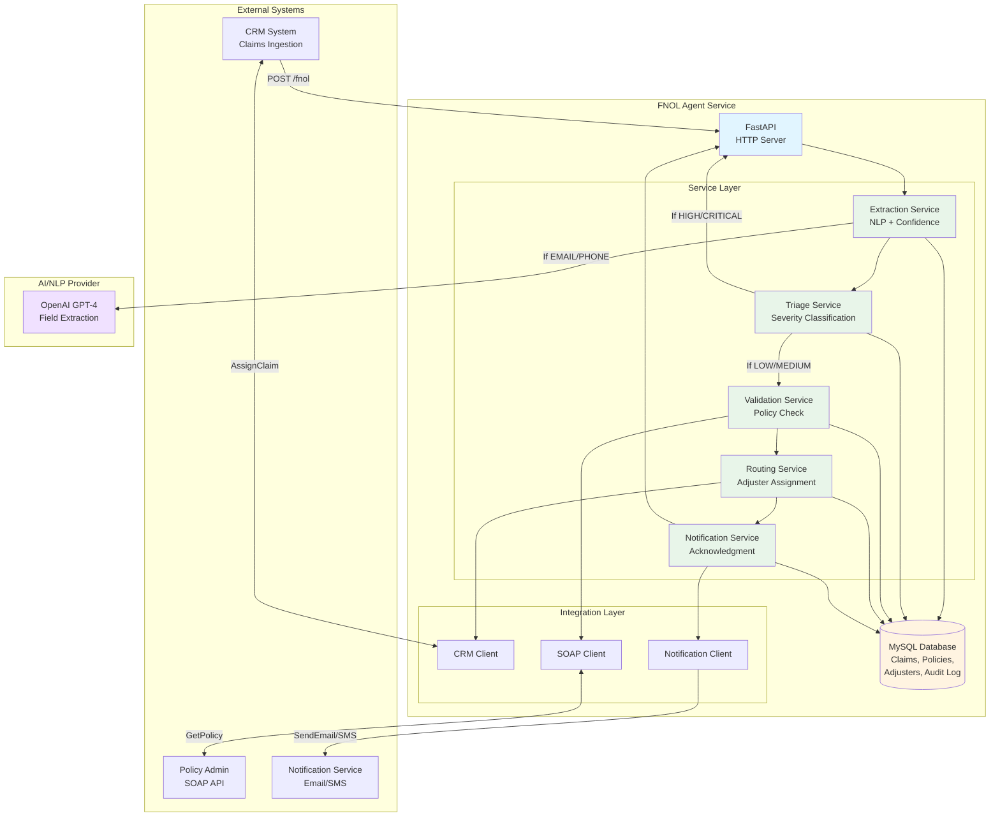
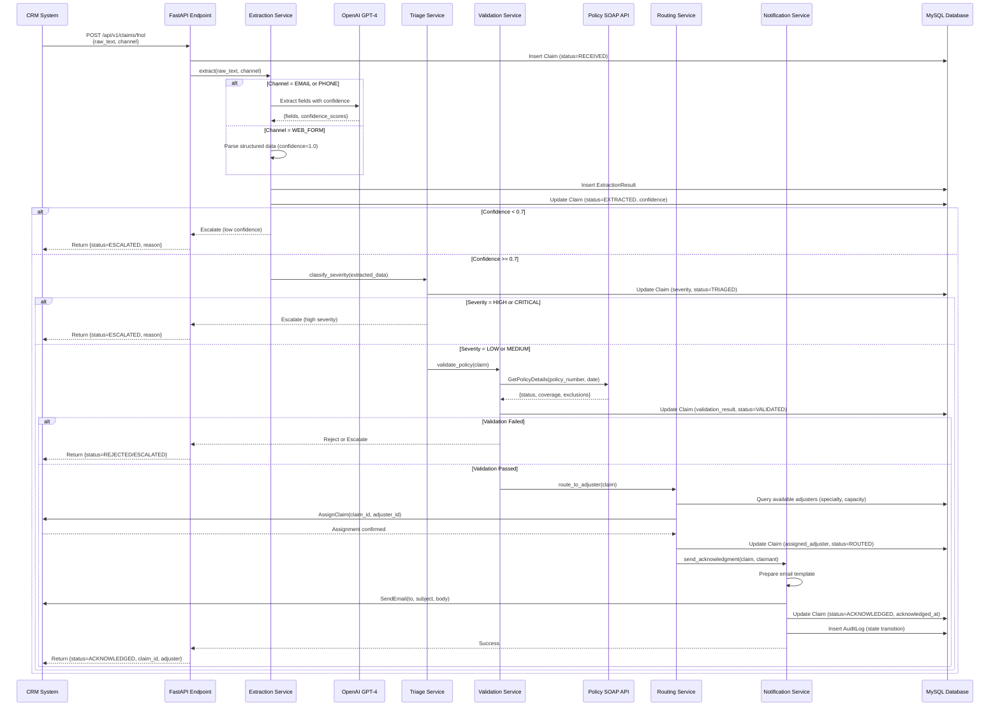

# Technical Design - FNOL Claims Processing Agent

**Document Version:** 1.0  
**Last Updated:** 2026-04-27  
**Status:** Foundation Design

---

## 1. Overview

This document describes the technical architecture and design decisions for the FNOL Claims Processing Agent. The system is designed as a web service that processes insurance claims through a 5-stage pipeline: extraction, triage, validation, routing, and acknowledgment.

### Design Principles

1. **AI-Native Architecture**: Agent logic is the core orchestrator, not a bolt-on feature
2. **Explicit State Management**: Every claim has a clear status with auditable transitions
3. **Graceful Degradation**: Mock modes and fallbacks for all external dependencies
4. **Observability First**: Structured logging, metrics, and audit trails for all decisions
5. **Buildable Specification**: All integration contracts and decision logic are fully specified

---

## 2. Technology Stack

### Core Application

- **Language**: Python 3.11+
- **Web Framework**: FastAPI 0.109.0
  - Native async/await support
  - Automatic OpenAPI documentation
  - Built-in request validation with Pydantic
- **HTTP Server**: Uvicorn (ASGI)
- **Configuration**: Pydantic Settings + .env files

### Data Layer

- **Database**: MySQL 8.0+
  - ACID compliance for claim state transitions
  - JSON columns for flexible schema (extraction_results, policy coverage)
  - Computed columns for SLA breach detection
- **ORM**: SQLAlchemy 2.0.25
  - Async support
  - Relationship management
  - Migration support (Alembic)
- **Database Driver**: PyMySQL 1.1.0

### AI/NLP Layer

- **Primary NLP Provider**: OpenAI GPT-4
  - Structured extraction from unstructured text (emails, phone transcripts)
  - Confidence scoring per field
  - Fallback to GPT-3.5-turbo for cost optimization
- **SDK**: openai 1.10.0
- **Mock Mode**: Regex-based extraction for development without API costs

### Integration Layer

- **SOAP Client**: zeep 4.2.1
  - For legacy Policy Administration System
  - WS-Security authentication
  - Retry logic with exponential backoff
- **REST APIs**: httpx (async HTTP client)
  - CRM API (claim ingestion, adjuster assignment)
  - Notification API (email, SMS acknowledgments)
- **Mock Integrations**: In-memory responses for all external systems

### Testing & Quality

- **Test Framework**: pytest 7.4.4
- **Coverage**: pytest-cov 4.1.0 (target: >85%)
- **Test Types**:
  - Unit tests: 200+ tests for business logic
  - Integration tests: 50 tests for external APIs
  - E2E tests: 10 critical scenarios

### Observability

- **Logging**: structlog 24.1.0
  - Structured JSON logs
  - Correlation IDs for request tracing
  - Log levels: DEBUG, INFO, WARNING, ERROR
- **Metrics**: Prometheus-compatible /metrics endpoint
  - Claims processed counter
  - SLA compliance gauge
  - Extraction confidence histogram
  - API latency histogram

---

## 3. System Architecture

### High-Level Architecture



### Data Flow: Claim Processing Pipeline



---

## 4. Component Design

### 4.1 API Layer (FastAPI)

**Responsibilities:**
- HTTP request/response handling
- Input validation (Pydantic schemas)
- Authentication/authorization (future)
- Rate limiting (future)
- Error handling and response formatting

**Key Endpoints:**
- `POST /api/v1/claims/fnol` - Submit new FNOL claim
- `GET /api/v1/claims/{claim_id}` - Get claim status
- `GET /api/v1/claims` - List claims (with filters)
- `GET /health` - Health check
- `GET /metrics` - Prometheus metrics

**Configuration:**
- CORS middleware (configurable origins)
- Request timeout: 60 seconds
- Max request size: 10 MB

### 4.2 Service Layer

#### Extraction Service
**Purpose:** Convert unstructured FNOL reports into structured data

**Key Method:**
```python
def extract(raw_content: str, source_channel: str) -> ExtractionResult
```

**Logic:**
- If `WEB_FORM`: Parse structured JSON (confidence = 1.0)
- If `EMAIL` or `PHONE`: Use OpenAI GPT-4 with structured prompt
- Extract fields: policy_number, incident_date, incident_type, estimated_value, injury_severity, description
- Calculate confidence per field (0.0-1.0)
- Return overall_confidence = min(field_confidences)

**Mock Mode:** Regex-based extraction with confidence = 0.9

---

#### Triage Service
**Purpose:** Classify claims by severity based on business rules

**Key Method:**
```python
def classify_severity(
    estimated_value: float,
    injury_severity: str,
    policy_type: str,
    incident_type: str,
    exclusion_flags: bool,
    vip_status: bool
) -> TriageResult
```

**Rules:**
- **CRITICAL**: value > $100K OR injury = FATAL OR vip_status = True OR multi_party_liability
- **HIGH**: value > $50K OR injury IN [SERIOUS, HOSPITALIZED] OR exclusion_flags = True
- **MEDIUM**: $5K <= value <= $50K OR injury = MINOR
- **LOW**: value < $5K AND injury IN [NONE, null] AND policy_type = STANDARD

**Confidence Calculation:**
- 1.0: All inputs present, clear threshold match
- 0.8: Missing estimated_value (use incident_type proxy)
- 0.6: Missing both value and injury

**Escalation Trigger:** severity IN [HIGH, CRITICAL] OR confidence < 0.7

---

#### Validation Service
**Purpose:** Verify policy coverage via SOAP API

**Key Method:**
```python
def validate_policy(claim: Claim) -> ValidationResult
```

**Validation Steps:**
1. Check policy status = ACTIVE
2. Check incident_date within coverage period [effective_date, expiration_date]
3. Check coverage_types includes incident_type coverage
4. Check exclusions for claim rejection triggers

**Result:**
- **VALIDATED**: All checks pass
- **REJECTED**: Policy inactive, out of period, or exclusion applies
- **ESCALATED**: SOAP timeout, ambiguous exclusion, or unexpected response

**SOAP Integration:**
- Endpoint: `https://policy-admin.company.internal/soap/PolicyService`
- Timeout: 8 seconds
- Retry: 2 attempts with exponential backoff (2s, 4s)

---

#### Routing Service
**Purpose:** Assign claims to appropriate adjusters

**Key Method:**
```python
def route_to_adjuster(claim: Claim) -> RoutingResult
```

**Logic:**
1. Determine required specialty from incident_type:
   - AUTO_COLLISION → AUTO specialty
   - PROPERTY_DAMAGE → PROPERTY specialty
   - BODILY_INJURY → INJURY specialty
2. Filter adjusters:
   - Has required specialty
   - Seniority >= SENIOR (if severity = HIGH/CRITICAL)
   - Status = AVAILABLE
   - current_workload < max_workload
3. Select adjuster with lowest workload
4. Assign via CRM API
5. Increment adjuster workload in database

**Fallback:** If no adjuster available, escalate to routing queue

---

#### Notification Service
**Purpose:** Send acknowledgment messages to claimants

**Key Method:**
```python
def send_acknowledgment(claim: Claim, claimant: Claimant) -> NotificationResult
```

**Logic:**
1. Select template based on severity
2. Populate variables: claimant_name, claim_number, adjuster_name, sla_deadline
3. Choose channel: claimant.preferred_contact_method (EMAIL, SMS)
4. Send via Notification API
5. Retry: 3 attempts with 2-second delay

**Templates:**
- LOW: "Your claim has been received and assigned to {adjuster_name}. Ref: {claim_number}"
- MEDIUM: "Your claim requires additional review. An adjuster will contact you within 24 hours. Ref: {claim_number}"
- ESCALATED: "Your claim has been received and is being reviewed by a specialist. Ref: {claim_number}"

---

### 4.3 Integration Layer

#### CRM Client
**Responsibilities:**
- Receive FNOL submissions (webhook handler)
- Assign claims to adjusters
- Update adjuster workload

**Mock Mode:** In-memory responses with 100ms simulated latency

---

#### Policy SOAP Client
**Responsibilities:**
- Query policy details
- Validate coverage
- Handle WS-Security authentication

**Library:** zeep 4.2.1
**Mock Mode:** Returns ACTIVE policy with standard coverage

---

#### Notification Client
**Responsibilities:**
- Send emails via REST API
- Send SMS via REST API

**Mock Mode:** Logs notification to console, returns success

---

### 4.4 Data Layer (MySQL + SQLAlchemy)

**Key Tables:**
- `claims` - Main entity (30+ columns, state machine)
- `claimants` - Claimant details
- `policies` - Policy coverage (cached from SOAP)
- `adjusters` - Adjuster profiles and workload
- `extraction_results` - Detailed NLP extraction data
- `audit_log` - All state transitions
- `severity_overrides` - Track when adjusters change agent's severity

**Design Patterns:**
- UUID primary keys for distributed systems
- Enum columns for status/severity (type safety)
- JSON columns for flexible data (coverage_types, extracted_fields)
- Computed columns for SLA breach detection
- Foreign keys with ON DELETE CASCADE
- Indexes on query columns (status, severity, sla_deadline)

---

## 5. Configuration Management

### Environment Variables (.env)

**Database:**
```bash
DB_HOST=localhost
DB_PORT=3306
DB_NAME=fnol_claims
DB_USER=fnol_user
DB_PASSWORD=<secret>
```

**External APIs:**
```bash
CRM_API_URL=https://crm.company.internal/api
CRM_API_TOKEN=<secret>
POLICY_SOAP_URL=https://policy-admin.company.internal/soap/PolicyService
POLICY_SOAP_USERNAME=<username>
POLICY_SOAP_PASSWORD=<secret>
NOTIFICATION_API_URL=https://notifications.company.internal/api
NOTIFICATION_API_TOKEN=<secret>
OPENAI_API_KEY=<secret>
```

**Agent Behavior:**
```bash
EXTRACTION_CONFIDENCE_THRESHOLD=0.7
SEVERITY_THRESHOLDS_LOW=5000
SEVERITY_THRESHOLDS_HIGH=50000
SEVERITY_THRESHOLDS_CRITICAL=100000
SLA_TARGET_MINUTES=5
NLP_PROVIDER=openai  # or "mock"
```

**Mock Modes:**
```bash
ENABLE_MOCK_INTEGRATIONS=true
MOCK_CRM_API=true
MOCK_POLICY_SOAP=true
MOCK_NOTIFICATION_API=true
```

### Configuration Loader (Pydantic)

```python
from pydantic_settings import BaseSettings

class Settings(BaseSettings):
    db_host: str = Field(default="localhost", alias="DB_HOST")
    db_password: str = Field(default="", alias="DB_PASSWORD")
    extraction_confidence_threshold: float = Field(default=0.7)
    enable_mock_integrations: bool = Field(default=True)
    
    @property
    def database_url(self) -> str:
        return f"mysql+pymysql://{self.db_user}:{self.db_password}@{self.db_host}:{self.db_port}/{self.db_name}"
    
    class Config:
        env_file = ".env"
        case_sensitive = False

settings = Settings()
```

---

## 6. Error Handling & Resilience

### Retry Strategy

**SOAP Policy API:**
- Retries: 2 attempts
- Backoff: Exponential (2s, 4s)
- Fallback: Escalate claim with reason "Policy system unavailable"

**CRM API:**
- Retries: 2 attempts
- Backoff: Exponential (1s, 2s)
- Fallback: Escalate claim with reason "CRM assignment failed"

**Notification API:**
- Retries: 3 attempts
- Backoff: Fixed 2-second delay
- Fallback: Log failure, do not block claim processing (notification is async)

### Error Categories

**Validation Errors (4xx):**
- Missing required fields
- Invalid policy number format
- Incident date in future
- Response: HTTP 400 with error details

**Integration Errors (5xx):**
- SOAP timeout
- CRM API unavailable
- OpenAI API rate limit
- Response: Escalate claim, HTTP 202 Accepted with escalation reason

**Internal Errors (5xx):**
- Database connection failure
- Unexpected exception
- Response: HTTP 500 with correlation ID for debugging

---

## 7. Observability & Monitoring

### Structured Logging

**Log Format:** JSON with structured fields
```json
{
  "timestamp": "2026-04-27T10:30:45.123Z",
  "level": "INFO",
  "event": "claim_extraction_complete",
  "claim_id": "550e8400-e29b-41d4-a716-446655440001",
  "correlation_id": "req-abc123",
  "confidence": 0.87,
  "method": "NLP_LLM",
  "processing_time_ms": 1234
}
```

**Key Events:**
- `claim_received` - New FNOL submitted
- `claim_extraction_complete` - NLP extraction done
- `claim_triaged` - Severity classified
- `claim_validated` - Policy check complete
- `claim_routed` - Adjuster assigned
- `claim_acknowledged` - Notification sent
- `claim_escalated` - Escalation triggered
- `integration_error` - External API failure

### Metrics (Prometheus)

**Counters:**
- `fnol_claims_total` (labels: severity, status)
- `fnol_escalations_total` (labels: reason)
- `fnol_rejections_total` (labels: reason)

**Gauges:**
- `fnol_sla_compliance_rate` (rolling 24h)
- `fnol_extraction_confidence_avg` (rolling 24h)
- `fnol_routing_accuracy_rate` (rolling 24h)
- `fnol_claims_in_progress` (current)

**Histograms:**
- `fnol_processing_duration_seconds` (labels: stage)
- `fnol_api_request_duration_seconds` (labels: endpoint)

### Alerting Targets

- SLA breach rate > 5% (rolling 1h) → Page on-call
- Extraction confidence < 0.6 avg (rolling 1h) → Alert engineering
- SOAP timeout rate > 10% (rolling 5m) → Alert infrastructure
- Claim processing duration > 60s (p95) → Alert engineering

---

## 8. Security Considerations

### Authentication & Authorization (Future)

**Phase 1 (MVP):** No authentication (internal network only)
**Phase 2 (Production):**
- API key authentication for CRM integration
- JWT tokens for admin UI
- Role-based access control (RBAC)

### Secrets Management

**Development:** `.env` files (never committed to Git)
**Production:** AWS Secrets Manager or HashiCorp Vault

### Data Protection

- No PII in logs (redact SSN, full credit card numbers)
- Database encryption at rest (MySQL Transparent Data Encryption)
- HTTPS/TLS for all external API calls
- Audit log retention: 7 years (regulatory compliance)

### Input Validation

- All API inputs validated with Pydantic schemas
- SQL injection protection (SQLAlchemy parameterized queries)
- XSS protection (FastAPI automatic HTML escaping)
- Max request size: 10 MB

---

## 9. Deployment Architecture

### Local Development

```
Developer Machine
├── Python 3.11 (venv)
├── MySQL 8.0 (local install)
├── .env (mock integrations enabled)
└── FastAPI (uvicorn with --reload)
```

### Staging Environment (Future)

```
Staging Server (Linux VM)
├── Python 3.11 (systemd service)
├── MySQL 8.0 (RDS or dedicated instance)
├── Nginx (reverse proxy)
├── .env (test environment credentials)
└── Mock integrations disabled
```

### Production Environment (Future)

```
Production Kubernetes Cluster
├── FNOL Agent (3 replicas, auto-scaling)
├── MySQL 8.0 (RDS Multi-AZ)
├── Nginx Ingress Controller
├── Secrets from AWS Secrets Manager
├── CloudWatch Logs & Metrics
└── All real integrations
```

---

## 10. Testing Strategy

### Unit Tests (200+ tests)

**Target:** Business logic in services
- Extraction: 40 tests (each field, confidence edge cases)
- Triage: 50 tests (all severity boundaries, confidence calculations)
- Validation: 30 tests (policy states, date ranges, exclusions)
- Routing: 40 tests (specialty matching, workload balancing)
- Notification: 20 tests (template rendering, retry logic)

**Tooling:** pytest with fixtures, no external calls (mocked)

### Integration Tests (50 tests)

**Target:** API clients and database
- CRM client: 10 tests (success, timeout, retry, auth failure)
- SOAP client: 15 tests (valid response, fault, timeout, invalid XML)
- Notification client: 10 tests (success, retry, rate limit)
- Database models: 15 tests (CRUD, relationships, transactions)

**Tooling:** pytest with test database, mock external APIs

### End-to-End Tests (10 tests)

**Target:** Full claim processing pipeline
- LOW claim happy path (web form → acknowledged)
- MEDIUM claim with oversight (email → acknowledged with oversight flag)
- HIGH claim escalation (phone → escalated, no routing)
- Policy validation failure (expired policy → rejected)
- SOAP timeout (retry → escalate)
- Missing estimated value (triage with proxy → routed)
- Boundary value at $5000 (LOW vs MEDIUM)
- Adjuster at max capacity (route to next available)
- VIP claimant (CRITICAL severity, immediate escalation)
- Silent failure detection (wrong specialty assigned → detected by audit)

**Tooling:** pytest with full stack (database + mocked external APIs)

---

## 11. Performance Targets

**Throughput:**
- 300 claims/day sustained
- Peak: 50 claims/hour (burst)

**Latency:**
- p50: <10s (end-to-end)
- p95: <30s
- p99: <60s

**Availability:**
- Target: 99.5% (43.8 minutes downtime/month)

**Scalability:**
- Single server handles 300 claims/day
- Horizontal scaling: Add replicas for higher volume (future)

---

## 12. Technical Assumptions

**A-TECH-1: Python 3.11+ Available**
- Assumption: Target deployment environment has Python 3.11+
- Rationale: Required for async/await improvements and type hints
- If wrong: Downgrade to Python 3.9 (remove some type features)
- Validation: Check deployment environment spec

**A-TECH-2: MySQL 8.0+ Available**
- Assumption: MySQL 8.0+ for JSON columns and computed columns
- Rationale: JSON columns used for flexible schema, computed columns for SLA breach
- If wrong: Downgrade to MySQL 5.7 (refactor JSON queries, move SLA logic to application)
- Validation: Check database infrastructure spec

**A-TECH-3: OpenAI API Accessible**
- Assumption: Production environment can reach api.openai.com (HTTPS)
- Rationale: Required for NLP extraction from emails/phone
- If wrong: Use alternative NLP provider (Anthropic, Cohere) or on-premise model
- Validation: Test API connectivity from production network

**A-TECH-4: SOAP API Response Time < 5s (p95)**
- Assumption: Policy SOAP API responds within 5 seconds (p95)
- Rationale: 8-second timeout allows for retries within 60s SLA
- If wrong: Increase timeout, reduce retry attempts, or cache more aggressively
- Validation: Load test SOAP API in staging

**A-TECH-5: CRM Webhook Reliability**
- Assumption: CRM sends FNOL webhook reliably (no deduplication needed)
- Rationale: Simplifies API design (no idempotency keys)
- If wrong: Add idempotency layer (claim_number uniqueness check)
- Validation: Review CRM webhook documentation

**A-TECH-6: Single-Server Deployment Sufficient**
- Assumption: 300 claims/day can be handled by single server
- Rationale: Cost optimization for pilot phase
- If wrong: Deploy multiple replicas with load balancer
- Validation: Load test with 500 claims/day simulation

**A-TECH-7: No Authentication Required (Phase 1)**
- Assumption: Internal network deployment, no public internet exposure
- Rationale: Simplifies MVP, faster time to pilot
- If wrong: Add API key authentication layer
- Validation: Confirm network architecture with infrastructure team

**A-TECH-8: .env Configuration Acceptable**
- Assumption: .env files acceptable for development and staging
- Rationale: Simplifies local development
- If wrong: Migrate to centralized secrets manager (AWS Secrets Manager, Vault)
- Validation: Review production security requirements

---

## 13. Technical Risks

**R-TECH-1: OpenAI API Rate Limits**
- Risk: OpenAI rate limits block claim processing during peak hours
- Impact: Claims delayed, SLA breach
- Mitigation: Implement queue with exponential backoff, use GPT-3.5-turbo for retries
- Probability: Medium | Impact: High

**R-TECH-2: SOAP API Instability**
- Risk: Legacy SOAP system has frequent timeouts or downtime
- Impact: Claims escalated unnecessarily, manual validation required
- Mitigation: Aggressive caching (cache_ttl=24h for ACTIVE policies), fallback to manual queue
- Probability: High | Impact: Medium

**R-TECH-3: Database Connection Pool Exhaustion**
- Risk: SQLAlchemy connection pool exhausted during burst traffic
- Impact: 500 errors, claim processing failures
- Mitigation: Tune pool size (pool_size=20, max_overflow=10), add connection timeouts
- Probability: Low | Impact: High

**R-TECH-4: NLP Extraction Accuracy Degradation**
- Risk: OpenAI model updates change extraction quality
- Impact: Lower confidence scores, more escalations, lower automation rate
- Mitigation: Pin specific model version (gpt-4-turbo-2024-04-09), A/B test model updates
- Probability: Low | Impact: Medium

---

## 14. Next Steps for Implementation

### Phase 1: Local Development Setup (Week 1)
1. Create Python virtual environment
2. Install dependencies (`requirements.txt`)
3. Setup MySQL database (`database_schema.sql`)
4. Configure `.env` file (mock mode enabled)
5. Start FastAPI server, verify health check

### Phase 2: Core Services (Week 2-3)
1. Build SQLAlchemy models (`src/models/`)
2. Build Extraction Service (`src/services/extraction_service.py`)
3. Build Triage Service (`src/services/triage_service.py`)
4. Build Validation Service + SOAP Client (`src/services/validation_service.py`, `src/integrations/policy_soap_client.py`)
5. Build Routing Service + CRM Client (`src/services/routing_service.py`, `src/integrations/crm_client.py`)
6. Build Notification Service + Notification Client (`src/services/notification_service.py`, `src/integrations/notification_client.py`)

### Phase 3: API Integration (Week 4)
1. Build Claims API endpoint (`src/api/claims.py`)
2. Wire up end-to-end pipeline
3. Add error handling and retries
4. Add structured logging and metrics
5. Integration tests with mocked external APIs

### Phase 4: Testing & Documentation (Week 5)
1. Write unit tests (target: >85% coverage)
2. Write integration tests (50 tests)
3. Write E2E tests (10 critical scenarios)
4. Load testing (simulate 300 claims/day)
5. Documentation (API guide, architecture diagrams)

### Phase 5: Pilot & Production (Week 6+)
1. Deploy to staging environment
2. Disable mock integrations, connect to test systems
3. Run pilot with 10% traffic (2 weeks)
4. Iterate based on feedback
5. Gradual rollout to 100% traffic

---

## 15. Document Revision History

| Version | Date       | Author | Changes                          |
|---------|------------|--------|----------------------------------|
| 1.0     | 2026-04-27 | FDE    | Initial technical design created |

---

**End of Technical Design Document**
